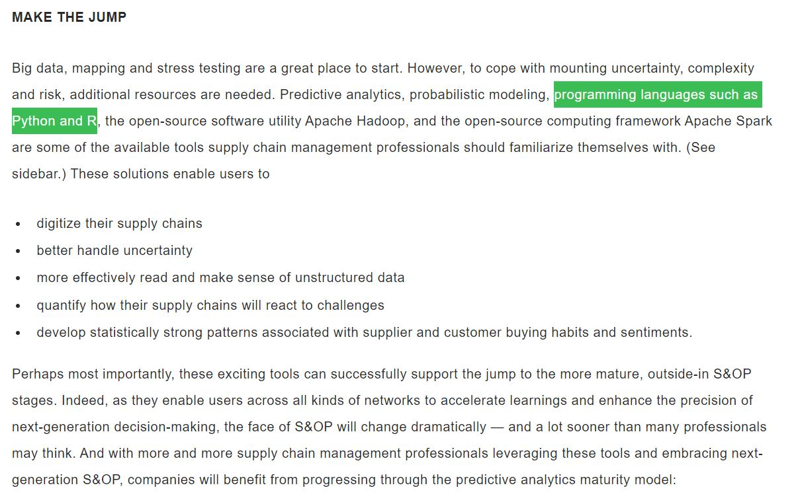
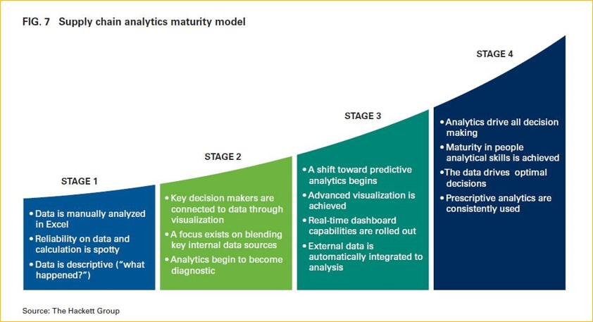
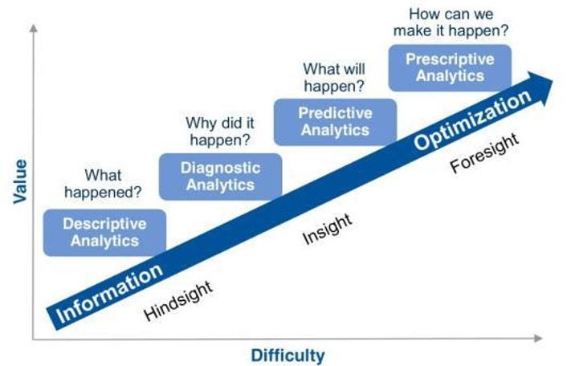

```{r setup, include=FALSE}
knitr::opts_chunk$set(echo = FALSE)
```


## APICS: S&OP and digital supply chain

A few months ago, **APICS** published [an article](https://https://www.ascm.org/ascm-blog/sop-and-the-digital-supply-chain/?utm_source=LinkedIn&utm_medium=social&utm_campaign=ASCMblog2019&utm_content=03292019) about the use of R and Python to manage the Sales and Operations Planning (S&OP) process.  

Here are some extracts:  
**THE S&OP INNOVATIONS TO WATCH**  

**PREDICTIVE ANALYTICS** involves mining information from data sets in order to identify useful patterns and forecast the likelihood of future events. As increased supply chain complexity puts pressure on even the most well-run S&OP processes, accurate demand planning via predictive analytics is a valuable advantage. Supply chain management professionals can benefit by using predictive analytics to analyze and consolidate data from all areas of the enterprise in order to make informed, effective, real-time decisions.  

**PROBABILISTIC MODELING** involves statistical analysis of historical data in order to estimate the chance of an event occurring again. In S&OP, it makes it possible for supply chain management professionals to identify unknown risks and develop contingency plans.  

**PYTHON AND R** are open-source programming languages. R is most often used to solve statistical problems, machine learning and data science. It also offers packages that enable users to perform time series analysis, panel data and data mining. Python offers a more wideranging, data science methodology. **Both can meaningfully enhance the S&OP process**.  

**APACHE HADOOP AND SPARK** can process large data sets with simple programming models. These solutions can create more accurate analytic decisions in response to the internet of things, artificial intelligence, the cloud and mobile. Hadoop also helps users optimize enterprise data warehouses, drive better decision-making and cut costs by moving “cold” or siloed data to a data lake.  





## 4 different types of analytics




## Descriptive Predictive Prescriptive analytics  





