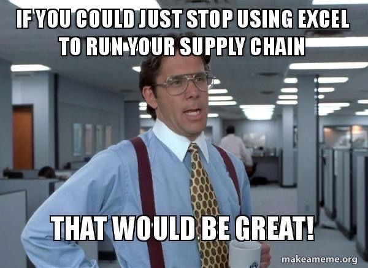
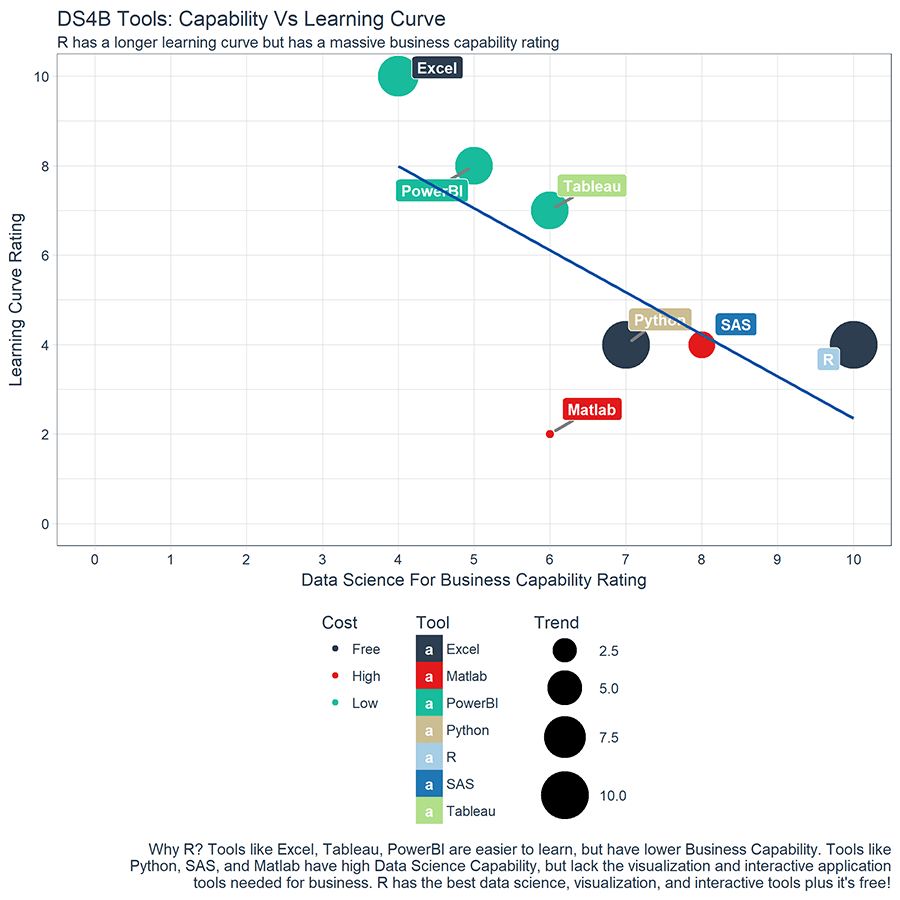

```{r setup, include=FALSE}
knitr::opts_chunk$set(echo = FALSE)
```

## What is R?

**Programming language:**  

* **script which works like a "full program"** (similar to an Excel macro) and like a command for a punctual action  

* **created by / for statisticians**: "working with data" is at the heart of this platform  

* **open source (free)**: though some services / supports could be invoiced, the core of the platform is fully free  
* **supported by a very large community**: the users base of R is over the ones of SPSS and SAS (but not yet Excel!); the digital analytists community of R grows quickly  

* **connectable with multiple sources of data**: several "packages" have been created to connect to platforms of digital analytics through their APIs, as well as to Google Sheets  

> Why using R (instead of Excel?) ?

In a few words:  
* **reproducibility**: possibility to write a function (or a script) for one project / client and to **reuse** it for others  
* **flexibility**: a lot (yes, really a lot) of open source packages to realize powerful operations  
* **evolution / extensions**: (much more than Excel!) can be used on the cloud with the same code  
* **operability**: works with (almost) the same code on Linux, Mac and Windows   





## How easy and powerful it is?


> Learning Curve & (best) Capability rating

**6 goods reasons** mentionned by [Rbloggers](https://www.r-bloggers.com/six-reasons-to-learn-r-for-business/)  

* Reason 1: R Has The Best Overall Qualities  
* Reason 2: R Is Data Science For Non-Computer Scientists  
* Reason 3: Learning R Is Easy With The Tidyverse  
* Reason 4: R Has Brains, Muscle, And Heart  
* Reason 5: R Is Built For Business  
* Reason 6: R Community Support  



## Some examples of Charts


## Some examples of Tables


## R Shiny!


